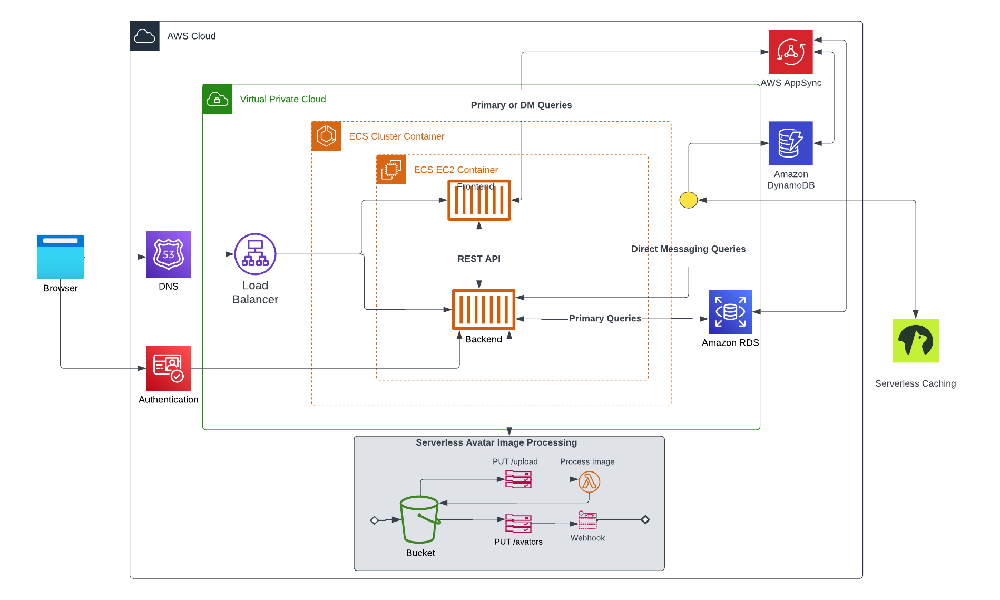

# Week 0 — Billing and Architecture

## Created Logical architectual Diagram in Lucid charts  

[[lucidChart](https://lucid.app/documents/view/e730cc85-0176-4c52-8acc-f213e74868df)](https://lucid.app/documents/view/e730cc85-0176-4c52-8acc-f213e74868df)

## Setup AWS CLI 

I have setup the AWS CLI both in the Gitpod workspace and the my local Desktop environment

In Gitpod, I used the below script to do the setup.
ON LINUX

- curl "https://awscli.amazonaws.com/awscli-exe-linux-x86_64.zip" -o "awscliv2.zip"
- unzip awscliv2.zip
- sudo ./aws/install

