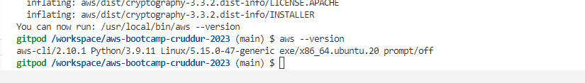
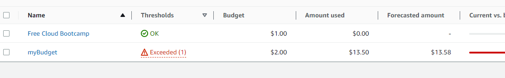
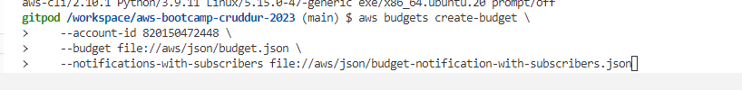

# Week 0 — Billing and Architecture

## Created Logical architectual Diagram in Lucid charts  

[[lucidChart](https://lucid.app/documents/view/e730cc85-0176-4c52-8acc-f213e74868df)](https://lucid.app/documents/view/e730cc85-0176-4c52-8acc-f213e74868df)

## Setup AWS CLI 

I have setup the AWS CLI both in the Gitpod workspace and the my local Desktop environment

In Gitpod, I used the below script to do the setup.
ON LINUX

- curl "https://awscli.amazonaws.com/awscli-exe-linux-x86_64.zip" -o "awscliv2.zip"
- unzip awscliv2.zip
- sudo ./aws/install

## Created AWS Budget

AWS Budgets lets you set custom cost and usage budgets that alert you when your budget thresholds are exceeded (or forecasted to exceed).

Script to create AWS Budget using the AWS CLI

aws budgets create-budget \
    --account-id 820150472448 \
    --budget file://aws/json/budget.json \
    --notifications-with-subscribers file://aws/json/budget-notification-with-subscribers.json

